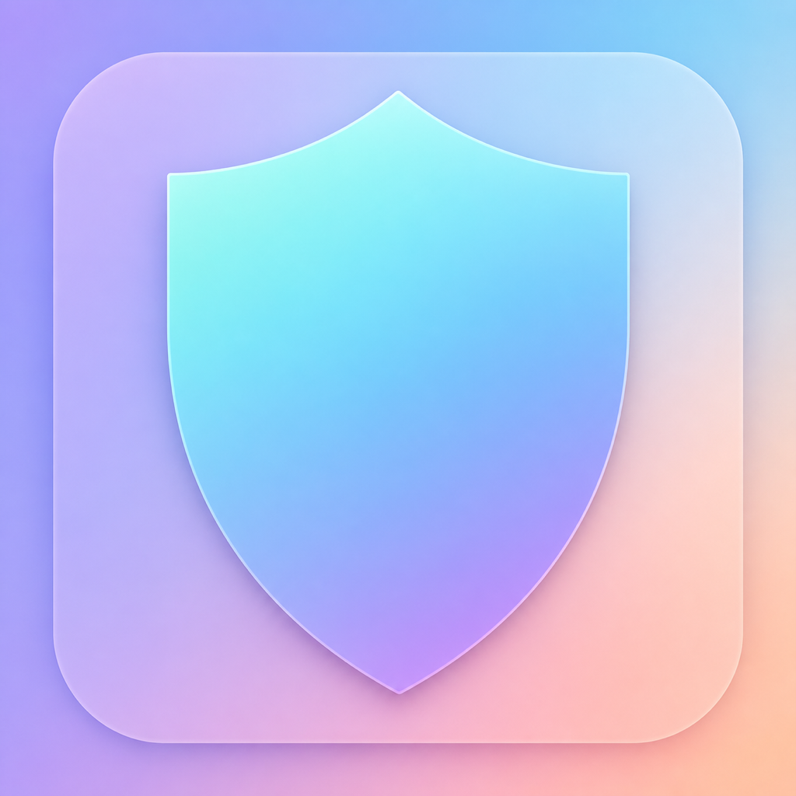
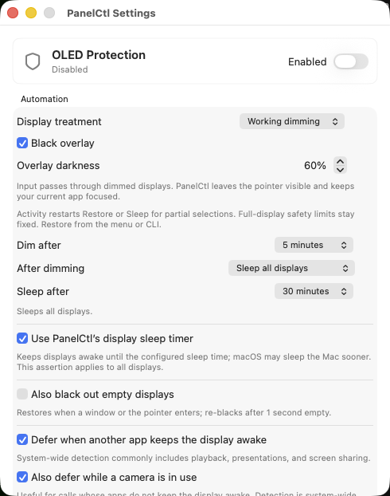

<p align="center">
  
</p>

<h1 align="center">panelctl</h1>

A macOS CLI and menu-bar app for OLED blackouts, click-through working dimming,
display sleep, inventory, and experimental DDC luminance control.

## Install

Download the universal app or CLI from
[GitHub Releases](https://github.com/brettinternet/panelctl/releases), or build
the CLI on macOS 13 or newer:

```sh
swift build -c release --product panelctl
mkdir -p ~/.local/bin
install -m 0755 .build/release/panelctl ~/.local/bin/panelctl
```

Release artifacts are ad-hoc signed, not Developer ID signed or notarized. If
macOS blocks the app, verify its checksum and source, then use **Open Anyway**
in System Settings → Privacy & Security or control-click it and choose **Open**.

## Menu-bar app

Move `PanelCtl.app` to `/Applications`, open it, select displays, and enable
protection. It supports per-display blackouts, optional all-display sleep,
hardware dimming, snooze, launch at login, and configurable idle and restore
timers.

Closing Settings does not stop protection. Quitting removes the blackout and
stops the watcher. Reopen the app to show Settings when its menu icon is hidden.

## CLI

```sh
panelctl list
panelctl blackout --display DISPLAY_UUID --idle-after 5m --watch
panelctl blackout --display DISPLAY_UUID --mode working --overlay-opacity 60 --dim-to 25 --timeout 1h
panelctl blackout --index 3 --timeout 1h
panelctl blackout --all --idle-after 5m --sleep-after 30m --keep-displays-awake
panelctl sleep-displays --keep-system-awake
panelctl wake-displays
panelctl ddc-luminance --display index:2
panelctl ddc-luminance --display index:2 --set 75
```

Selectors accept a display UUID, decimal or hexadecimal CG ID, or `index:N`.
Indexes can change after reconnecting displays, so unattended watchers should
use UUIDs. Durations accept seconds or an `s`, `m`, or `h` suffix.

Run `panelctl help` or `panelctl <command> --help` for all options.



### Blackout behavior

Blocking mode is the default. When the pointer is on a display blacked out by
the menu-bar app, PanelCtl takes focus so macOS will hide the cursor. Moving to
an active display or restoring returns focus to the previous app. Plain Escape
is a best-effort, app-managed restore only after that proxy has activated. The
standalone CLI has no background Escape or cursor guarantee.

`--mode working` instead installs a click-through dimming overlay. PanelCtl
does not activate, change focus, hide the pointer, or consume keyboard input.
Use `--overlay-opacity 1...100` to set overlay darkness or `--no-overlay` to
disable composited darkening. Restore working dimming from the status menu,
`panelctl app restore`, or its configured Restore/Sleep endpoint.

- Without `--idle-after`, treatment starts immediately.
- Input restores a blocking blackout. `--timeout` restores after a limit;
  `--sleep-after` instead sleeps every display.
- `--keep-blackout-on-input` keeps a partial blocking blackout installed during
  activity and restarts its configured Restore or Sleep duration. Working mode
  always uses this behavior for partial selections. When every drawable display
  is selected, activity never extends the original finite endpoint.
- `--watch` requires `--idle-after` and repeats after each restored cycle.
- `--all` requires `--timeout` or `--sleep-after`; finite Restore/Sleep remains
  mandatory for every full-coverage selection.
- `--caffeinate` explicitly prevents idle system sleep (advanced behavior).
  `--keep-displays-awake` is valid with `--sleep-after` and keeps displays
  awake until that endpoint while allowing macOS to sleep the Mac sooner. The
  display assertion is global, so it applies to all displays.
- Automatic idle treatment pauses while macOS reports that another app is
  keeping the display awake, then restarts the full idle countdown when it ends.
  Camera activity can also defer treatment when configured. Manual blackout-now
  commands are not deferred.
- `--dim-to 0...100` best-effort lowers each supported external display to that
  percentage of its reported DDC luminance maximum and restores the captured
  value. It never raises brightness. Blocking `--keep-blackout-on-input` cannot
  use hardware brightness; explicit working mode can.

Display, session, or sleep changes fail open by removing the blackout. Windows
are shown only after their screen IDs and frames are verified.

### App automation

The CLI can control the app's saved configuration from scripts and Shortcuts:

```sh
panelctl app enable
panelctl app disable
panelctl app toggle
panelctl app status --json
panelctl app blackout-now
panelctl app restore
panelctl app sleep-now
panelctl app snooze --for 30m
panelctl app resume
panelctl app open-settings
```

Use the bundled CLI if the standalone one is not installed:

```sh
/Applications/PanelCtl.app/Contents/Helpers/panelctl app toggle
```

`status` does not launch the app; other commands start it in the background if
needed. Only `open-settings` shows a window. Status exits `0` when the app
answers, `3` when it is not running, and `1` on control failure. JSON status may
include `nextAction`, `secondsRemaining`, and `snoozedUntil`.

For a persistent CLI watcher, edit the executable path and display UUID in the
[LaunchAgent example](examples/com.brettinternet.panelctl.blackout.plist).

## Limits and safety

An opaque pure-black window minimizes OLED pixel emission but does not sleep
the display electronics or guarantee a panel compensation cycle. A partially
transparent working overlay only reduces visible output; it does not guarantee
unlit OLED pixels or panel longevity. Use all-display sleep for long unattended
periods.

macOS provides no public per-display sleep or disconnect setter. Private
topology calls can make a display difficult to recover, so panelctl does not use
them. See [the feasibility note](docs/feasibility.md) for the API and hardware
evidence.

DDC depends on the monitor and connection. `ddc-luminance --set` persists and
does not restore the previous value. Blackout `--dim-to` journals captured
values, but recovery can be delayed after a crash or disconnect. DDC power/DPMS
is not implemented.

## Development

```sh
swift test --disable-sandbox
swift build --product panelctl
swift build --product PanelCtlApp
scripts/test-release-version.sh
```

Package releases with `scripts/package-release.sh vMAJOR.MINOR.PATCH`.
