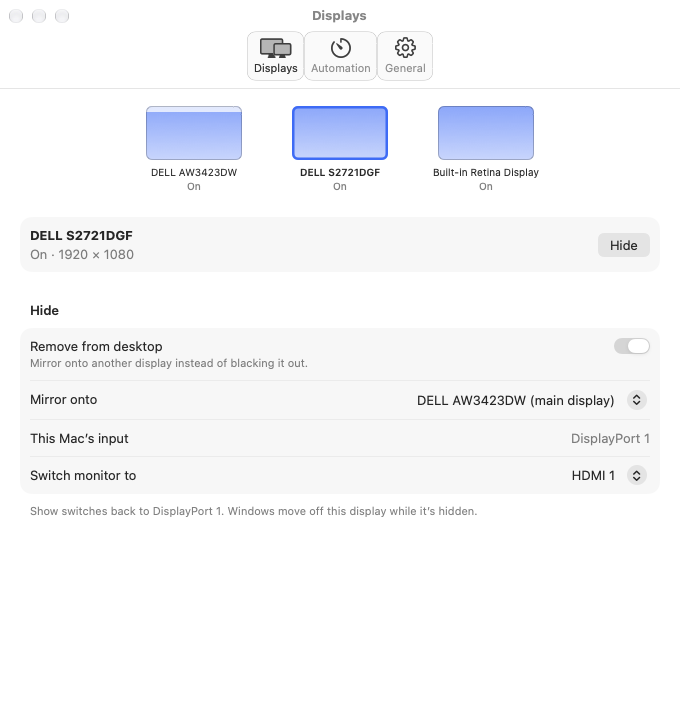

# Usage

## Quick start

```sh
panelctl list                                           # find display UUIDs
panelctl blackout --display UUID --idle-after 5m --watch
panelctl blackout --display UUID --mode working --overlay-opacity 60 --dim-to 25 --timeout 1h
panelctl blackout --all --idle-after 5m --sleep-after 30m --keep-displays-awake
panelctl sleep-displays --keep-system-awake
panelctl wake-displays
panelctl ddc-luminance --display index:2 --set 75
```

Selectors accept a UUID, a decimal or hex Core Graphics ID, or `index:N`.
Indexes and IDs change on reconnect, so scripts and watchers should use UUIDs.
Durations accept seconds or an `s`, `m` or `h` suffix.

## Blackout

| Mode | Effect | Ends on |
| --- | --- | --- |
| Blocking (default) | Opaque black window; app takes focus so macOS hides the cursor | Input, `--timeout`, or `--sleep-after` |
| `--mode working` | Click-through dimming; focus, pointer and keyboard untouched | `--timeout`, `--sleep-after`, menu Restore, `panelctl app restore` |

| Flag | Behavior |
| --- | --- |
| `--idle-after D` | Wait for idle; without it, treatment starts immediately |
| `--watch` | Repeat after each restore; requires `--idle-after` |
| `--timeout D` / `--sleep-after D` | Restore after D, or sleep every display after D |
| `--keep-blackout-on-input` | Partial blocking blackout survives activity and restarts its endpoint (always on in working mode) |
| `--overlay-opacity 1...100` / `--no-overlay` | Working-mode darkness, or no composited darkening |
| `--dim-to 0...100` | Lower supported externals over DDC, then restore captured brightness; never raises. Not with blocking `--keep-blackout-on-input` |
| `--blackout-empty-displays` | Black out selected displays that have no windows |
| `--caffeinate` | Prevent idle system sleep |
| `--keep-displays-awake` | Keep displays awake until `--sleep-after` while unlocked; the Mac may still sleep |

Rules:

- `--all`, and any selection covering every display, needs `--timeout` or
  `--sleep-after`. Activity never extends that endpoint.
- Automatic treatment waits while another app holds a display-awake assertion
  (or a configured camera is active), then restarts the full countdown. Manual
  commands are never deferred.
- Display, session or sleep changes fail open by removing the blackout. Windows
  appear only after their screen IDs and frames are verified.
- In the app, Escape with the pointer on a black display restores it. The
  standalone CLI has no background Escape or cursor guarantee.

## Menu-bar app

Move `PanelCtl.app` to `/Applications` and open it. Settings has three tabs:
**Displays** (per-display Hide/Show, input switching, scripts), **Automation**
(idle blackout, dimming, timers, pause rules) and **General** (launch at login,
menu icon, Experimental features).

Select a display tile to see its state, Hide/Show button, setup and inline
results. Hide defaults to **Black out**: it leaves the desktop in place and
stays black until Show or Escape with the pointer on that display. It is not
the same as an automation blackout: **Restore** does not show a hidden display.

To move windows off eligible external displays, enable **General → Experimental
features**, accept the configuration-time prompt, then turn on **Remove from
desktop** for each target. Choose **Mirror onto** and optionally **Switch
monitor to**. Multiple healthy removals can coexist, including several targets
onto one source. Each tile, menu item and scripted status is per target; setup
for other displays stays editable. Show any target in any order: it returns only
that display, and the remaining targets stay removed. The final Show verifies
the exact pre-first-Hide arrangement, modes and main display before switching
back to the Mac's detected input. Turning Experimental features off makes new
Hides black out instead, but never removes Show or recovery for a removed
display. Multi-display combinations are offline-tested only and remain
unqualified until each live write is separately approved.

The menu also offers per-display Hide/Show; each Show leaves other removed
displays untouched. **Show and Quit** restores each healthy removed target in
turn and quits only after all succeed. Results stay inline, including
input-switch warnings; ordinary Hide/Show has no per-operation confirmation.
Private disconnect is separate and requires its own scoped consent each time.
See [Hide styles and safety boundaries](display-hide-ux.md).



*Rendered using fake display fixtures, not a live monitor trial.*

Closing Settings keeps automation and Black out Hides running. Quitting clears
app-owned covers and stops the watcher, but a removed desktop may remain hidden;
the quit prompt offers **Show and Quit**. Reopen the app to show Settings when
the menu icon is hidden. Recovery problems appear on the affected display (or
above the tiles), with a Review banner on the other tabs and **Review Display
Recovery…** in the menu.

## App automation

```sh
panelctl app enable | disable | toggle
panelctl app status --json
panelctl app blackout-now | restore | sleep-now
panelctl app snooze --for 30m
panelctl app resume
panelctl app open-settings
panelctl app hide | show | toggle-hide --display UUID [--json]
```

Without a standalone install, use the bundled CLI:
`/Applications/PanelCtl.app/Contents/Helpers/panelctl`.

`status`, `hide`, `show` and `toggle-hide` never launch the app. Other commands
start it in the background; only `open-settings` shows a window. `restore` only
removes protection; it never shows a hidden display or switches inputs.

### Scripted Hide and Show

`hide`, `show` and `toggle-hide` press a display's Hide/Show button in the
running app, using its Hide style (see [Hide and Show](display-hide-ux.md)).
Settings → Displays → Scripts shows the exact command. For a Stream Deck button
or a Shortcuts **Run Shell Script** action:

```sh
/Applications/PanelCtl.app/Contents/Helpers/panelctl app toggle-hide \
  --display DISPLAY_UUID --json
```

```json
{ "outcome": "done", "summary": "<desktop result>", "detail": "<input result>", "displays": [ … ] }
```

Replace `DISPLAY_UUID` with the UUID from `panelctl list`, or use the exact
command copied from the app. Keep the exit status if your automation needs to
detect failure or partial success.

The command waits up to 30 seconds and is never queued or resent. A display
already in the requested state returns `no-op` without another input switch.

| Exit | `outcome` | Meaning |
| --- | --- | --- |
| 0 | `done`, `no-op` | Success |
| 1 | `refused`, `busy`, `failed`, `response-lost` | Not done. Refusals: another Hide/Show running, displays asleep or changing, unknown UUID, display can't hide, last visible display |
| 2 | — | Invalid arguments (usage on stderr, no JSON) |
| 3 | — | App not running |
| 5 | `partial` | Desktop changed; monitor input switch skipped, unverified or failed |
| 6 | `recovery-needed` | Unresolved display recovery; only Show is allowed |

On `response-lost`, check `app status --json` before doing anything else.

### Status JSON

```json
{
  "ok": true, "running": true, "enabled": true, "state": "waiting",
  "summary": "…", "nextAction": "blackout", "secondsRemaining": 240,
  "displays": [
    { "targetUUID": "…", "observedState": "hidden-by-panelctl", "operation": "idle", "recoveryNeeded": false },
    { "targetUUID": "…", "observedState": "hidden-by-panelctl", "operation": "idle", "recoveryNeeded": false }
  ]
}
```

The `displays` array includes one status entry per discovered or journaled
target. A disconnected removed display remains listed as unavailable/recovery
needed instead of being silently dropped.

- `state` is the protection state (`disabled`, `waiting`, …). `ok: true` means status answered, not that
  every operation succeeded.
- `observedState`: `separate`, `hidden-by-panelctl` (including blacked out),
  `mirrored-externally`, `unavailable`, `recovery-needed`,
  `unsupported-recovery` or `unknown`. `operation`: `idle`, `hiding`, `showing`.
- `lastInputOutcome` is the last input result **in this app session**, not a
  live reading. Relaunch clears it. It may include `detail` and the
  `recoveryCommand` that switches the input back.
- Oversized status fails rather than drop evidence. An oversized Hide/Show reply
  keeps `outcome` and `summary` and omits `displays` and `detail`.

Only explicit commands hide a display. Idle, startup, wake and reconnection
never do. For a persistent CLI watcher, edit the
[LaunchAgent example](../examples/com.brettinternet.panelctl.blackout.plist).

## Experimental display commands

| Command | What it does | Docs |
| --- | --- | --- |
| `ddc-input` | Read or switch a monitor's input over DDC | [DDC input](ddc-input.md) |
| `ddc-power` | Explicit experimental monitor On/Off; manual recovery may be required | [Power semantics, consent and qualification](ddc-power.md) |
| `mirror` / `unmirror` | Add a public-mirror removal or Show one target | [Mirroring](display-mirroring.md) |
| `away` / `back` | Add a removal plus optional input switch, or Show one target | [Handoff](display-handoff.md) |
| `recovery …` | List, verify and restore journal entries | [Recovery](display-recovery.md) |
| `recovery disable` | Private signal removal; **currently always refuses** | [Display disable](display-disable.md) |

For one removed display, `unmirror --consent-unmirror` and `back --display
UUID` retain the legacy one-target behavior. With several removals, use
`unmirror --display UUID`, `back --display UUID`, or
`recovery restore --display UUID` to Show exactly one. `recovery status` reports
each entry; `recovery verify --display UUID` is read-only and never Shows. An
omitted selector for ambiguous multi-entry verify/restore/unmirror requests is
refused. `mirror` and `away` can add a new removal only beside a healthy session.
The last Show verifies the original pre-first-Hide layout, modes and main
display. Private disable refuses while removals remain, and removals refuse an
unresolved private-disable journal.

Each live topology or DDC write needs a deliberate decision on untested
hardware; consent flags acknowledge risk, they are not qualification. The
recorded CLI cycles qualify only their stated single-target setups; no
multi-display combination is hardware-qualified.

`ddc-power --display UUID --set off --accept-power-risk` acknowledges that
software wake may fail, the physical button may not suffice, and unplugging
monitor power may be required. `--set on` is best effort only; omit `--set` for
one power-state read. Only named `on` (0x01) and `off` (0x04) are supported.
At most one write and one readback; no retry or automatic restoration. Neither
command delivery nor matching readback proves visible panel state. No monitor
is power-qualified. Each live power read/write needs fresh scoped approval, a
present user, accessible physical power and another usable display. See the
[supervised protocol](ddc-power.md#supervised-qualification-protocol).
App power support is [planned within existing Hide/Show](display-hide-ux.md#planned-ddc-power-hide-style),
not a shipped app action or unattended automation feature.

## Limits

- An opaque black window leaves OLED pixels unlit but keeps the display
  electronics on and does not trigger panel compensation. The working overlay
  only reduces output. Use all-display sleep for long unattended periods.
- macOS has no public per-display sleep or disconnect. Normal protection never
  calls private topology APIs. See [feasibility](feasibility.md).
- DDC depends on monitor and connection. `ddc-luminance --set` persists and is
  not restored. `--dim-to` journals captured values, but restoration can be
  delayed by a crash or disconnect. Explicit experimental DDC power is CLI-only,
  may leave the desktop present and has no automatic restoration or guaranteed
  physical recovery. It is never part of blackout, wake, input switching or
  app Hide/Show.
